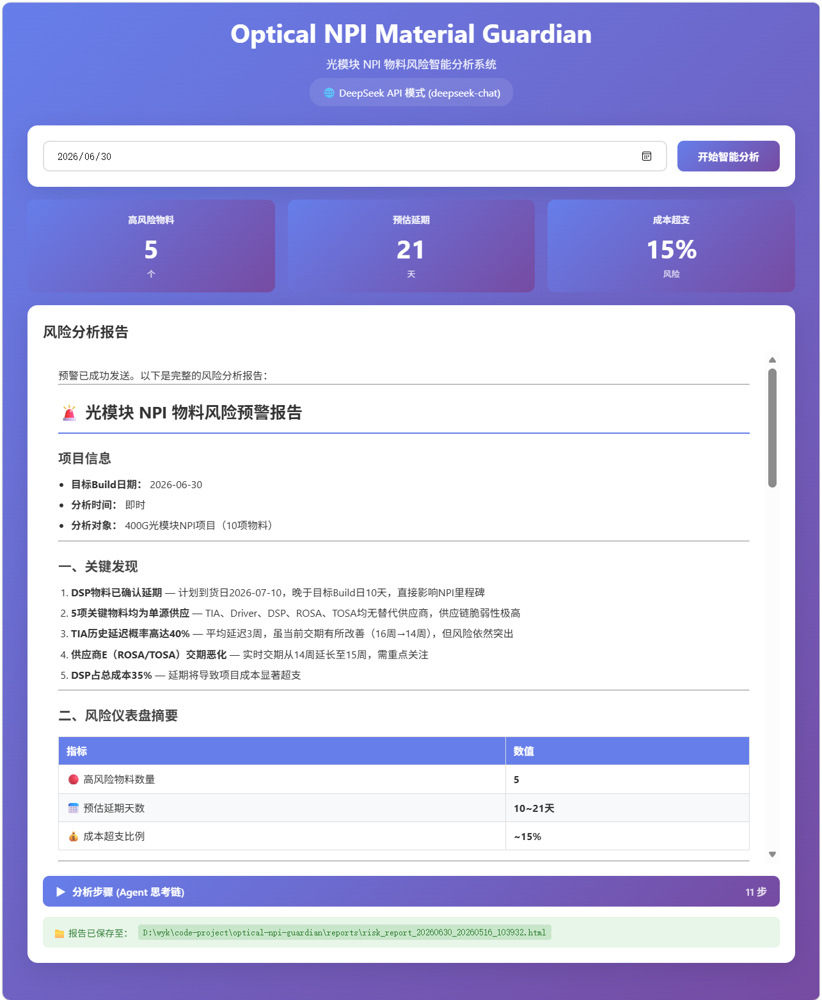
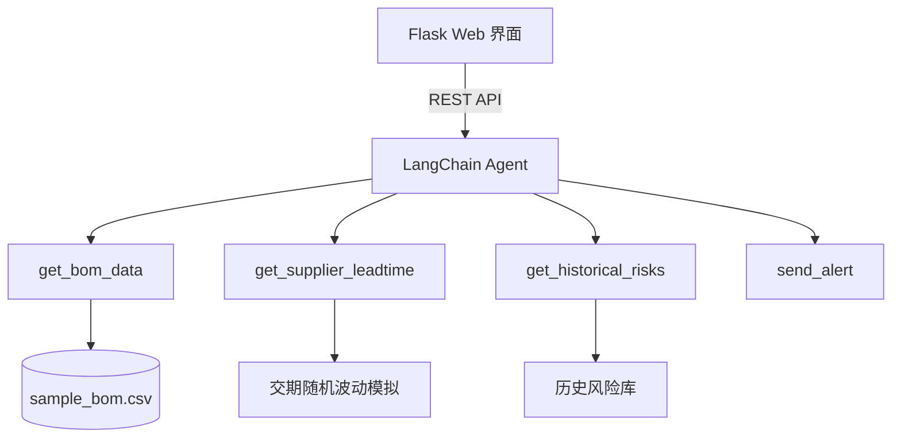

# Optical NPI Material Guardian

基于 LangChain Agent 的光模块 NPI 物料风险智能分析系统，专为 400G/800G 新产品导入场景设计。

> AI Agent 自主决策 | 供应链风险预警 | 实时仪表盘可视化

## ✨ 核心功能

- **智能风险分析**：输入目标 build 日期，Agent 自动获取 BOM、查询供应商交期、检索历史延迟记录，生成结构化风险报告。
- **仪表盘可视化**：前端展示高风险物料数量、预估延期天数、成本超支比例。
- **Agent 思考链**：可展开查看 AI 的每一步工具调用与决策过程，透明可信。
- **预警推送模拟**：分析完成后自动发送预警通知，形成完整业务闭环。
- **双模型支持**：可切换 DeepSeek API 或 Ollama 本地部署，灵活适配不同环境。

## 📸 界面预览

分析完成后，系统会展示风险仪表盘、详细报告及Agent思考链：



## 📊 系统架构



## 🛠 技术栈

- **后端**：Python 3.10+, Flask
- **AI 框架**：LangChain, LangChain OpenAI / Ollama
- **大模型**：DeepSeek-chat 或 Ollama 本地模型
- **前端**：原生 HTML/CSS/JS，响应式设计
- **数据**：Pandas 处理 CSV 模拟 BOM

## 🚀 快速开始

### 1. 克隆仓库
```bash
git clone https://github.com/yongkui/optical-npi-guardian.git
cd optical-npi-guardian
```

### 2. 安装依赖
```bash
pip install -r requirements.txt
```

### 3. 配置 API Key
在项目根目录创建 `.env` 文件，添加你的 DeepSeek API Key（使用本地 Ollama 则跳过）：
```
DEEPSEEK_API_KEY=sk-xxxxxxxxxxxxxxxx
```

### 4. （可选）使用本地 Ollama 模型
将 `agent.py` 中的 `USE_LOCAL_MODEL` 设为 `True`，并确保已安装 Ollama 及模型：
```bash
ollama pull deepseek-r1:7b
```

### 5. 启动应用
```bash
python app_flask.py
```
浏览器访问 `http://localhost:5000`

## 📁 项目结构

```
optical-npi-guardian/
├── agent.py               # LangChain Agent 定义、系统提示词
├── app_flask.py           # Flask Web 应用、前端模板、API 路由
├── tools.py               # Agent 工具函数
├── utils.py               # 通用工具函数
├── sample_bom.csv         # 模拟的光模块 BOM 数据
├── reports/               # 生成的风险分析报告（HTML 格式）
├── docs/                  # 项目文档和截图
├── requirements.txt       # Python 依赖
├── .env                   # 环境变量（需自行创建）
├── .gitignore             # Git 忽略配置
└── README.md
```

## 🧪 模拟数据说明

`sample_bom.csv` 模拟了一个 400G PAM4 光模块的物料清单，包含 DSP、TIA、Driver、ROSA、TOSA 等关键光电器件，以及供应商、交期、单价、单源标识等信息。所有数据均为虚构，仅用于功能演示。

## 🔮 未来扩展计划

- [ ] 对接企业 PLM/ERP 系统，获取真实 BOM 与交期数据
- [ ] 使用 MCP 协议标准化工具接口
- [ ] 增加缺陷分诊与知识库问答模块
- [ ] 支持导出 PDF/Excel 报告
- [ ] 引入预测性分析，利用历史数据训练风险预测模型

## 🤝 适用场景

- NPI 团队日常风险预警工具原型
- AI Agent 在供应链管理中的应用探索
- 光通信行业项目管理智能化实践

## 📝 作者

Yongkui Wang  
[GitHub](https://github.com/yongkui)
